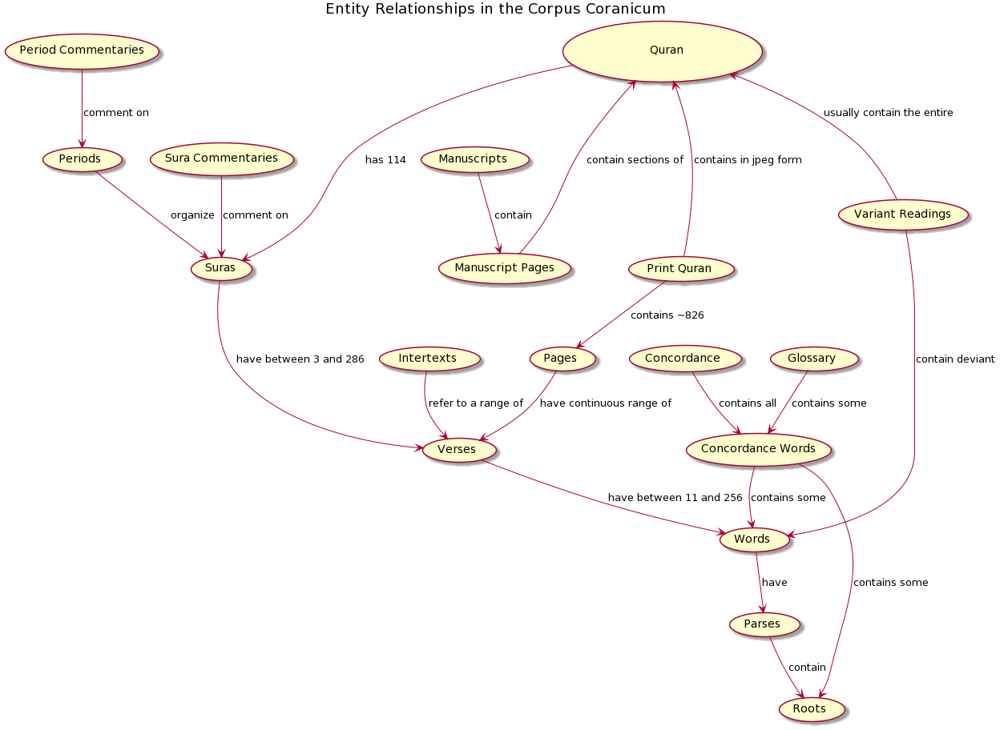

# Corpus Coranicum 2.0

This is the public Corpus Coranicum website.

## General Information


Here is an approximate Entity Relationship diagram of Corpus Corancium: 



## Local Development

Note that the entire project can be run with `docker-compose -f local.docker-compose.yml up --build`.  However, the dockerized version doesn't watch for changes to the source code and is there not practical for development.  The dockerized version, however, is useful with running end-2-end tests, since it includes the nginx servers that sit in front of the frontend and backend, so it most closely mimic the stage and production deployments.


### Issues:

At the moment, there is no solution to display public images, since they are on digilib, though you could download them to the local public folder.

At the moment, Open Sea Dragon images are not showing because the Cross-Origin-Header does not seem to be set correctly.

### Prerequisites

+ node and npm: it is recommended to install these with [nvm](https://github.com/nvm-sh/nvm). See [frontend readme](frontend/README.md) for more details.
+ php8 and a php mysql driver
+ [composer](https://getcomposer.org/doc/00-intro.md)
+ a mysql server. On Ubuntu, for example, this can be installed via: `sudo apt install mysql-server`.

### Setup

First, set up your mysql database. You have two options for doing this:

#### DB Setup Option 1 (Recommended): Docker and Docker-compose
+ Make sure Docker and Docker-compose are installed on your machine.
+ Acquire an sql dump file of the production database. Put it in the root project folder with the name `dump.sql`. Alternately, you can just create a symlink in the root folder: `ln -s [path to whereever you want to keep your dump file] dump.sql`
+ Run `docker-compose -f local.docker-compose.yml up --build db`

#### DB Setup Option 2: Manual install
+ Set up a mysql server on your machine.  For example, on ubuntu, you can `sudo apt install mysql-server`, then log in login into the database (`sudo mysql -u root`) to set up a user:
```
CREATE USER 'newuser'@'localhost' IDENTIFIED BY 'password';
GRANT ALL PRIVILEGES ON * . * TO 'newuser'@'localhost';
```
+ Acquire an sql dump file of the production database.  The file should have a `create database corpuscoranium` statement in it, which is the case when the dump is generated with the `--databases ` flag: `mysqldump -u user -ppassword --databases corpuscoranicum > dump.sql`
+ Import the database: `mysql -u user -ppassword < dump.sql`
+ you find an empty datadump in the folder /documentation

#### Frontend

Next, set up your frontend. From the `frontend` folder:
+ Install your frontend dependencies: `npm install`
+ Build your frontend: `npm run serve`

Finally, set up laravel. From the `backend` folder:
+ make your .env file: `cp .env.example .env`
+ change the database DB variables in the `.env` as necessary. If you used the DB Setup Option 1 with docker/docker-compose, then the variables should be correct.
+ Install your application dependencies: `composer install`
+ Run the applicaton: `php artisan serve`.

## Deployment

### Production

Building and deploying the project happens with the file `production.docker-compose.yml`, so to build:
`docker-compose -f production.docker-compose.yml build`, and to run: `docker-compose -f production.docker-compose.yml up`.

Note that the `nginx_backend` cannot find the connection to `php_backend` if you restart the `php_backend` without restarting `nginx_backend`.  Therefore, it is a good idea to do `--force-recreate` when starting up the backend services, so that nginx also restarts along with the `php-backend`.

Dependencies:
* Corpus Coranicum XML Files (this is a git repoistory. See in `production.docker-compose.yml` how it is wired up.)
* Public images and pdfs (at the moment they are connected via a docker-compose mount point to digilib. See in `production.docker-compose.yml`)

### Stage

Building and deploying the project happens with the file `stage.docker-compose.yml`, so to build:
`docker-compose -f stage.docker-compose.yml build`, and to run: `docker-compose -f stage.docker-compose.yml up`.

## Testing

See the Readme in the `end-to-end-testing` folder for more information.

## License

Corpus Coranicum 2.0 is free software: you can redistribute it and/or modify it under the terms of the GNU General Public License as published by the Free Software Foundation, either version 3 of the License, or (at your option) any later version.

Corpus Coranicum 2.0 is distributed in the hope that it will be useful, but WITHOUT ANY WARRANTY; without even the implied warranty of MERCHANTABILITY or FITNESS FOR A PARTICULAR PURPOSE. See the GNU General Public License for more details.

You should have received a copy of the GNU General Public License along with Corpus Coranicum 2.0. If not, see http://www.gnu.org/licenses/.
